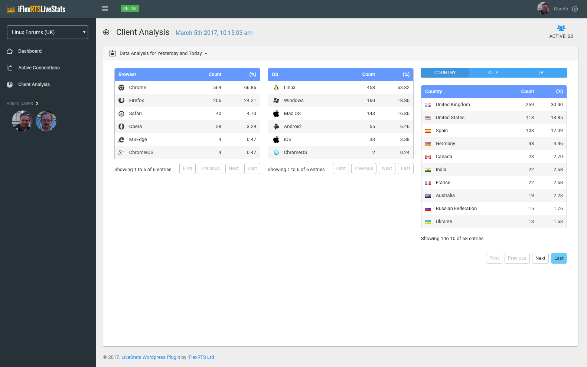
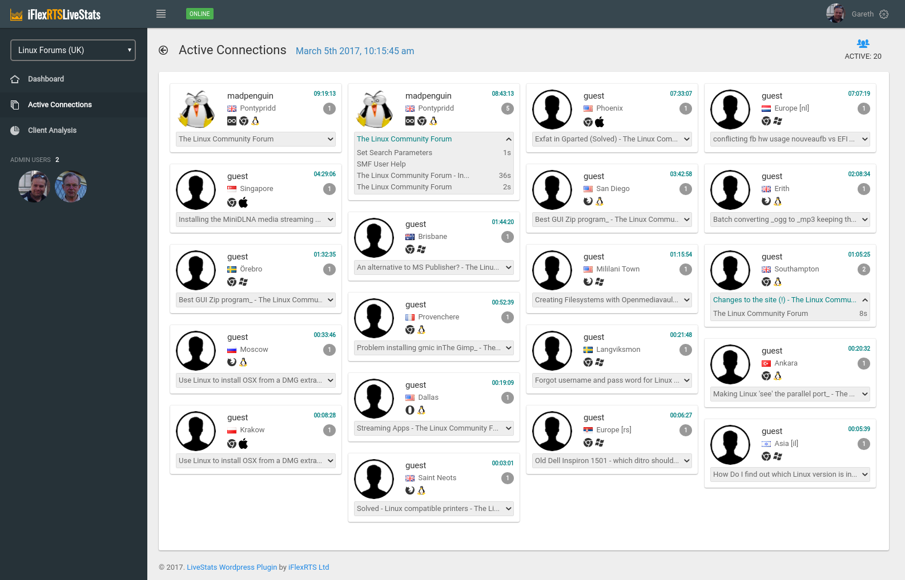
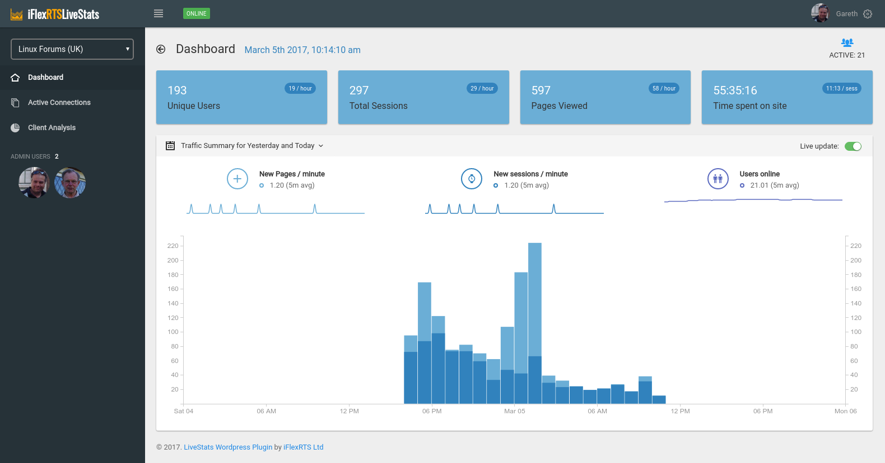

# Real-Time Analytics for webservers

This module leverages the SPA module for persistence, then uses Autobahn to maintain a persistent connection to a Crossbar.io server which records client activity in real time. (this is the client / browser module only)

Currently this is still Alpha, so once you have the code installed (see the HOWTO) you will need to apply for access by visiting the [LiveStats Admin Site](https://livestats.iflexrts.uk:8001) with a valid Google account, then emailing gareth at linux.co.uk quoting both your google email address and the site's URL.

## Screenshots

